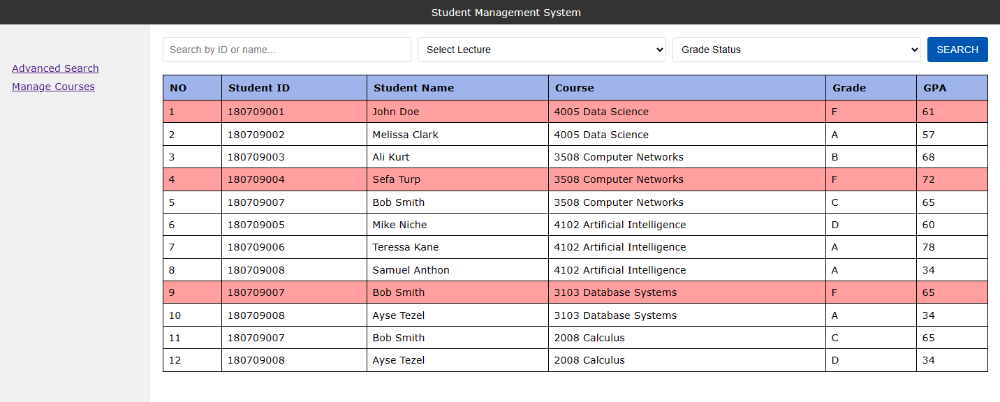
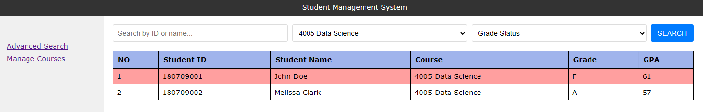
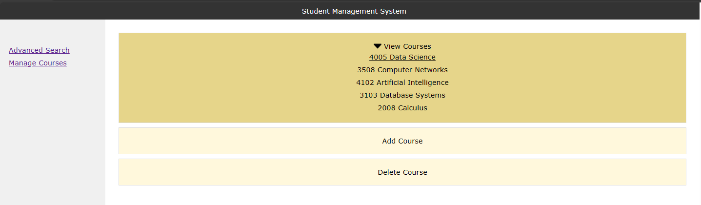
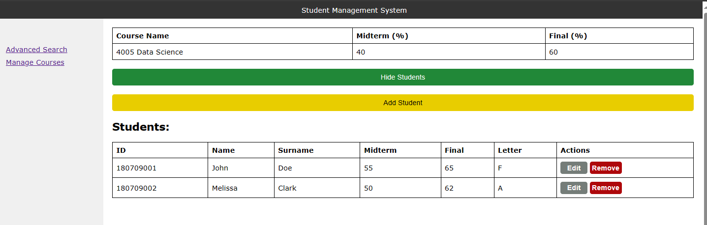
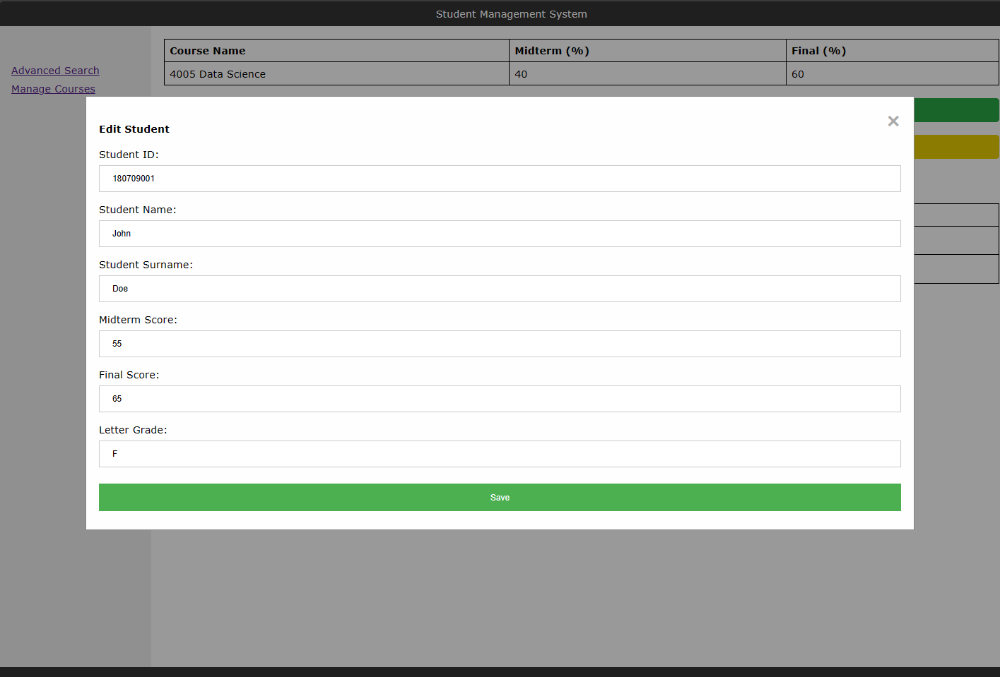
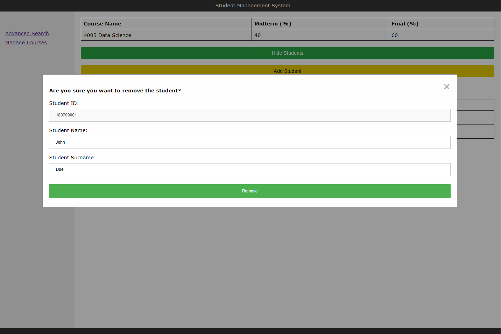
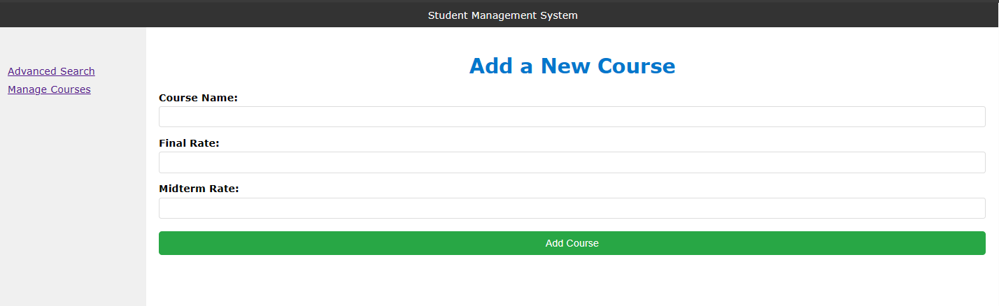
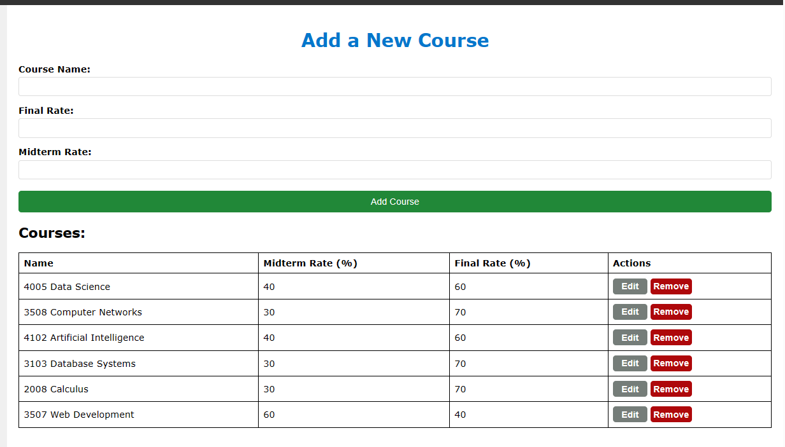
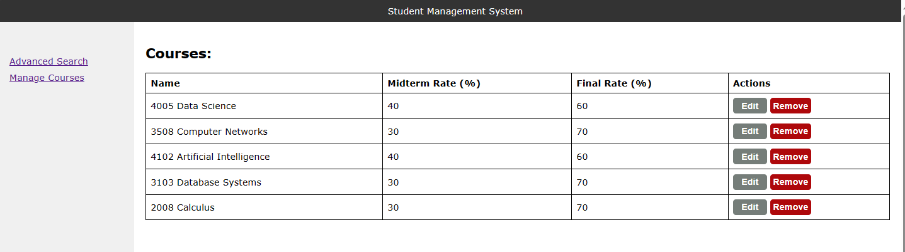
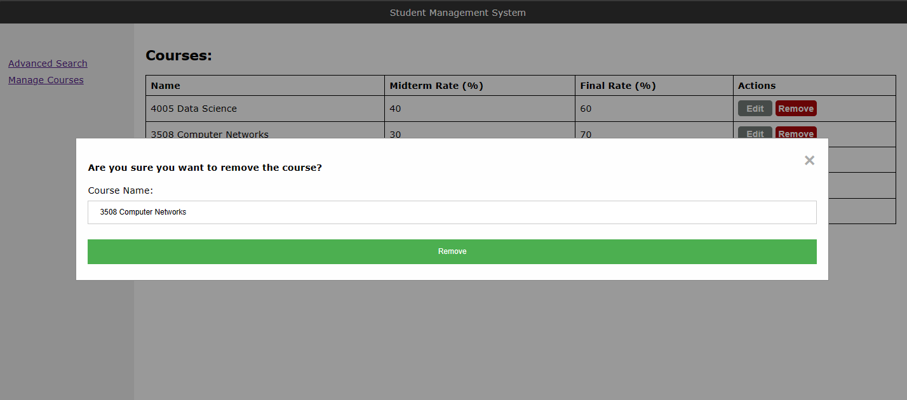

# WebDevFinalProject
A Student Management Application written in JavaScript without any 3rd part library. 
- HTML + CSS + JavaScript

### Details
--------------
- Automatically letter & grade calculation
- Automatically GPA calculation
- Modular view for Edit  & Remove operations

## Images
Homepage:

Advanced Search:

Course List (Dropdown, data fetched dynamically):

Click on a course:

Edit/Remove student from a course

Add New Course:

Delete Course:

